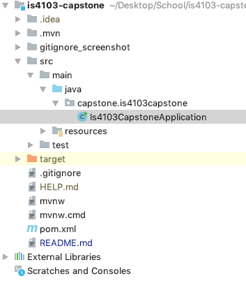
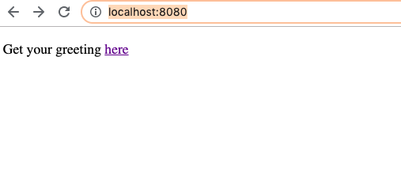
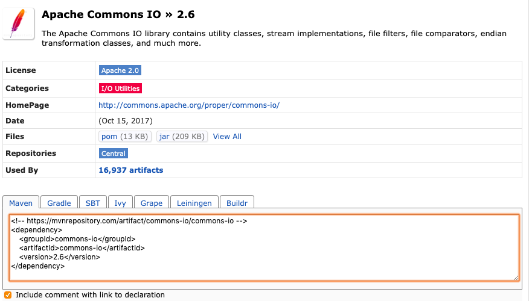

# Is4103-capstone

## Setting Up Project Dev Environment

1. Download the project from github
2. Open IntelliJ
3. Click 'import project' from the Dashboard to import the root folder of the downloaded project
4. Import project from external model (choose maven) -> next
5. Customize settings: 
	- check 'import Maven projects automatically'
	- JDK for importer: select java version 1.8
6. Next until the project is generated
7. In the application.properties file, search for "file.upload-dir" and change to your corresponding path

## Running the Project
Find the main application: Is4103CapstoneApplication.java

Right click anywhere in the file and select 

A sample controller & index page has been created. Open the browser, go to http://localhost:8080/ to view the webpage:

Then you are ready to go!

Make sure to branch out when commiting later changes! :D 

## Installing Dependencies (for future usage if any additional java libraries/jar needs to be included)
1. Go to https://mvnrepository.com/
2. Select the dependency & version
3. Copy the Maven dependency and copy to the corresponding place in pom.xml

4. Run bash: `mvn clean install` or right click pom.xml: Maven - Generate Sources and Update Folder

## Installed Dependencies
1. JPA
2. MySQL - JDBS Connector 
3. Junit
4. Spring Web Starter (for Restful services)

## Database Connection
The url and auth info are in `application.properties`
Demo schema is under `demo.sql`

## Error Handling
Whenever there is any 'pom' or 'maven' hasError, or when any dependencies have been added to pom.xml, do:
- Terminal: `mvn clean install`, or
- Right click pom.xml, select either:
1. Maven - Generate Sources and Update Folder
2. Maven - Reimport, or
3. Synchronize 'is4103-capstone'

## Spring Boot Examples
- Official Tutorial: https://spring.io/projects/spring-boot

