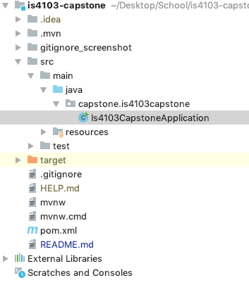
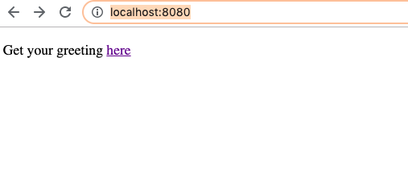

# Is4103-capstone

## Setting Up Project Dev Environment

0. Open IntelliJ
1. Click 'import project' from the Dashboard
2. Import project from external model (choose maven) -> next
3. Customize settings: 
	- check 'import Maven projects automatically'
	- JDK for importer: select java version 1.8
4. Next until the project is generated

## Running the Project
Find the main application: Is4103CapstoneApplication.java

Right click anywhere in the file and select 

A sample controller & index page has been created. Open the browser, go to http://localhost:8080/ to view the webpage as following:

## Installing Dependencies
1. Go to https://mvnrepository.com/
2. Select the dependency & version
3. Copy the Maven dependency and copy to the corresponding place in pom.xml

4. Run bash: `mvn clean install` or right click pom.xml: Maven - Generate Sources and Update Folder

## Installed Dependencies
1. JPA
2. MySQL - JDBS Connector 
3. Junit
4. Spring Web Starter (for Restful services)

## Error Handling
Whenever there is any 'pom' or 'maven' error, or when any dependencies have been added to pom.xml, do:
- Terminal: `mvn clean install`, or
- Right click pom.xml, select either:
1. Maven - Generate Sources and Update Folder
2. Maven - Reimport, or
3. Synchronize 'is4103-capstone'

## Spring Boot Examples
- Official Tutorial: https://spring.io/projects/spring-boot

